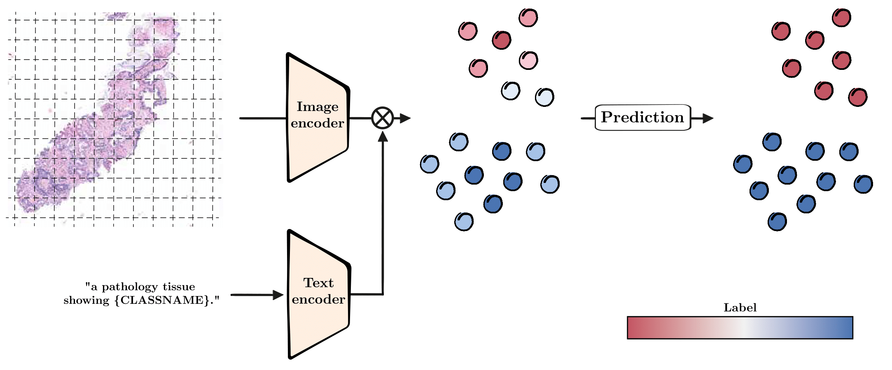

# Boosting VLMs for Histopathology Classification
The official implementation of [*Boosting Vision-Language Models for Histopathology Classification: Predict all at once*]().


This repo is built on top of [TransCLIP](https://github.com/MaxZanella/transduction-for-vlms).


## Table of Contents

1. [Introduction](#introduction) 
2. [Installation](#installation) 
3. [Usage](#usage)
4. [Citation](#citation)
5. [Contact](#contact) 


---

## Introduction

### Short abstract
We enhance vision-language models (VLMs) for histopathology by introducing a transductive approach that leverages text-based predictions and patch affinity. Histo-TransCLIP improves zero-shot classification accuracy without additional labels, processing 100,000 patches in seconds.

### Visual explanation
<p align="center">
  
  <br>
  <em>Figure 1: VLMs leverage textual descriptions of each class to generate pseudo-labels without any manual annotation. These initial predictions are then refined by leveraging the data structure thanks to the Laplacian term.</em>
</p>

### Results

|Dataset | CLIP | Quilt-B16 | Quilt-B32 |  PLIP | CONCH |
|----------|----------|----------|----------|----------|----------|
| SICAP-MIL   | Data 2   | Data 3   |  Data 3  | Data 3   |  Data 3  |
| LC(Lung)   | Data 2   | Data 3   |  Data 3  | Data 3   |  Data 3  |
| SKINCANCER   | Data 2   | Data 3   |  Data 3  | Data 3   |  Data 3  |
| NCT-CRC   | 25.39 | 29.61 |  53.73 | 63.17 | 66.27 |


## Installation

### Environment
Create a Python environment with your favorite environment manager. For example, with `conda`: 
```bash
conda create -y --name TransCLIP python=3.10.0
conda activate TransCLIP
pip3 install -r requirements.txt
```
And install Pytorch according to your configuration:
```bash
pip3 install torch==2.0.1 torchaudio==2.0.2 torchvision==0.15.2
```
## Datasets

Install each dataset from the following links:
1. [NCT](https://paperswithcode.com/dataset/nct-crc-he-100k)
2. [Sicap_MIL](https://github.com/jusiro/mil_histology)
3. [LC25000](https://github.com/tampapath/lung_colon_image_set)
4. [SkinCancer]()


## Usage
We present the basic usage to get started with our method. You have to pass the datasets folder path and the pre-computed prototypes folder path. Every script has pre-set parameters but you can change them manually.

### Histo VLM + TransCLIP-ZS
TransCLIP-ZS based on the textual embeddings of the zero-shot histological models.

- **Zero-Shot setting**

Here is an example for the NCT dataset, with the Quilt-1m architecture, and seed 1:
```bash
python3 main.py --root_path /path/to/datasets/folder --dataset nct --method TransCLIP  --seed 1 --model Quilt
```

To run the whole experiment, use the following command:
```bash
bash ./scripts/transclip_zs.sh /path/to/datasets/folder Quilt
```


